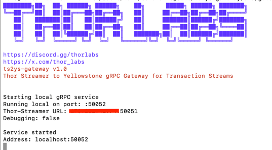

# TS2YS Gateway

A high-performance gateway service that transforms [ThorStreamer](https://github.com/thorlabsDev/ThorStreamer) events into [Yellowstone-gRPC](https://github.com/rpcpool/yellowstone-grpc) compatible format. This service acts as a bridge between ThorStreamer transaction streaming service and applications expecting Geyser-compatible data format.

## ⚠️ Important Notes

### Performance Notice
While this gateway provides compatibility with Yellowstone-gRPC/Geyser format, it introduces additional latency compared to native ThorStreamer integration. For optimal performance, we strongly recommend using ThorStreamer's native support in your applications when possible.

### Contact
This documentation provides comprehensive technical information for integrating with ThorStreamer. For additional support or questions, please contact our support team via our [discord server](https://discord.gg/thorlabs).

## Features

- Real-time transaction streaming
- Wallet address filtering
- Token program tracking
- Health check endpoint
- TLS support
- Configurable logging levels

## Supported Subscription Methods

This gateway currently supports the following [Yellowstone-gRPC](https://github.com/rpcpool/yellowstone-grpc) subscription methods:

### Transactions
```go
map<string, SubscribeRequestFilterTransactions> transactions = 3;
```
- Supports filtering by:
   - Vote transactions (`vote`)
   - Failed transactions (`failed`)
   - Account includes (`account_include`)
   - Account required (`account_required`)
   - Account excludes (`account_exclude`)

### Other Methods
The following methods from Yellowstone-gRPC are **not** currently supported:
- Account subscriptions
- Slot subscriptions
- Block subscriptions
- Block meta subscriptions
- Entry subscriptions
- Ping/Pong requests

We recommend using ThorStreamer's native client for any features not supported by this gateway.

## Installation

1. Download the appropriate binary for your platform from the Releases section
2. Extract the zip file
3. Configure `config.json` with your settings
4. Run the gateway service
5. Configure your Yellowstone-gRPC client to connect to this gateway (default: `localhost:50052`)

## Quick Start

1. Edit `config.json` and set your ThorStreamer URL and authentication token:
```json
{  "thor_streamer_addr": "<IP:PORT>",
   "thor_auth_token": "your-token-here"
}
```

2. Run the service:
```bash
# Linux/macOS
./ts2ys-gateway

# Windows
run.bat
```


## Configuration

The gateway is configured through `config.json`. Here's an example configuration with explanations for each field:

```json
{
   "listen_address": ":50052",           // Gateway's listen address and port
   "thor_streamer_addr": "<IP:PORT>",    // ThorStreamer service address
   "thor_auth_token": "your-token-here", // Your ThorStreamer authentication token
   "enable_tls": false,                  // Enable/disable TLS for the gateway
   "cert_file": "",                      // Path to TLS certificate file (if TLS enabled)
   "key_file": "",                       // Path to TLS key file (if TLS enabled)
   "debug": false,                       // Enable detailed debug logging
   "health_check_port": 8080             // Port for health check endpoint
   "enable_gzip": true                   // Enable GZIP compression for gRPC streams
}
```

### Configuration Fields

- `listen_address`: The address and port where the gateway will listen for incoming connections. Format is `":<port>"` for all interfaces or `"ip:<port>"` for specific interface.
- `thor_streamer_addr`: The address of your ThorStreamer service. Include both IP/hostname and port.
- `thor_auth_token`: Your authentication token for ThorStreamer service.
- `thor_streamer_type`: Subscription type:
  - `transaction`:(RECOMMENDED) Subscribe to transactions based on program IDs.
  - `wallet`: Subscribe to transactions by wallet addresses.
- `enable_tls`: Set to `true` to enable TLS encryption for incoming connections.
- `cert_file`: Path to your TLS certificate file (required if TLS is enabled).
- `key_file`: Path to your TLS private key file (required if TLS is enabled).
- `debug`: Set to `true` to enable verbose logging for troubleshooting.
- `health_check_port`: Port number for the health check HTTP endpoint.
- `enable_gzip`: Set to true to enable GZIP compression for gRPC streams.

### Health Check Endpoint

The gateway provides a health check endpoint that can be used to monitor the service status:

```bash
# Check service health
curl http://localhost:8080/healthz

# Response when healthy
200 OK
ok

# Response when not ready
503 Service Unavailable
not ready
```

The health check endpoint is useful for:
- Container orchestration systems (Kubernetes liveness/readiness probes)
- Load balancers
- Monitoring systems
- Service health verification

## Performance Considerations

This gateway performs the following operations which add latency:
- Protocol conversion between ThorStreamer and Yellowstone-gRPC formats
- Additional message routing and filtering
- Data transformation and validation

For latency-sensitive applications, consider implementing direct ThorStreamer integration instead of using this compatibility layer.

## License

Apache License 2.0 - See LICENSE file for details.

## Disclaimer
This software is provided "as is", without warranty of any kind, express or implied. The authors and maintainers are not responsible for any damages or losses that may arise from its use. Users should thoroughly test the gateway in their specific environment before deploying to production.
